  

## About

I build software with the goal of turning ideas into reliable and sustainable solutions.  
For me, technology is not just a tool, but a structured process: analyze, design, implement, improve.  
I am motivated by transforming complex requirements into clear, maintainable systems.

 

## Projects

### Featured

<ul>
  <li>
    <strong>Coderr</strong> — Freelancer marketplace backend (REST API, auth, roles, validation). 
    <em>(Django · DRF · PostgreSQL · Docker · JWT)</em>
    <a href="https://github.com/SusanneRenken/coderr/">Repo</a> ·
    <a href="https://coderr.susanne-renken.com">Live</a>
  </li>
  <li>
    <strong>KanMind</strong> — Kanban logic, clean data models, stable REST API. 
    <em>(Django · DRF · PostgreSQL · Docker)</em>
    <a href="https://github.com/SusanneRenken/kanmind/">Repo</a> ·
    <a href="https://kanmind.susanne-renken.com">Live</a>
  </li>
  <li>
    <strong>DA Bubble</strong> — Team-built real-time chat with modular Angular architecture. 
    <em>(Angular · TypeScript · Firebase)</em>
    <a href="https://github.com/SusanneRenken/DA-Bubble/">Repo</a> ·
    <a href="https://dabubble.susanne-renken.com/access">Live</a>
  </li>
  <li>
    <strong>Join</strong> — Kanban task manager with drag-and-drop and dynamic UI updates. 
    <em>(JavaScript · HTML · CSS · Firebase)</em>
    <a href="https://github.com/SusanneRenken/join/">Repo</a> ·
    <a href="https://join.susanne-renken.com">Live</a>
  </li>
</ul>

### Additional Projects

  
<strong>Show projects</strong>

  <ul>
    <li>
      <strong>Quizly</strong> — AI-powered quiz generation from YouTube videos. 
      <em>(DRF · FFmpeg · Whisper · Gemini API)</em>
      <a href="https://github.com/SusanneRenken/quizly/">Repo</a>
    </li>
    <li>
      <strong>Videoflix</strong> — Streaming backend with transcoding pipeline and HLS delivery. 
      <em>(Redis · django-rq · FFmpeg · HLS · Docker)</em>
      <a href="https://github.com/SusanneRenken/videoflix/">Repo</a>
    </li>
    <li>
      <strong>Sharkie</strong> — 2D browser game with Canvas, collisions and state management. 
      <em>(JavaScript · HTML · CSS · Firebase)</em>
      <a href="https://github.com/SusanneRenken/sharkie/">Repo</a> ·
      <a href="https://sharkie.susanne-renken.com">Live</a>
    </li>
  </ul>

  More details and demos: <a href="https://www.susanne-renken.com/">susanne-renken.com</a>

 

## Languages & Tools

### Core Technologies

<table>
  <tr>
    <td align="center" width="110">
       
      Angular
    </td>
    <td align="center" width="110">
       
      RxJS
    </td>
    <td align="center" width="110">
       
      TypeScript
    </td>
    <td align="center" width="110">
       
      JavaScript
    </td>
    <td align="center" width="110">
       
      Python
    </td>
    <td align="center" width="110">
       
      Django
    </td>
    <td align="center" width="110">
       
      DRF
    </td>
    <td align="center" width="110">
       
      PostgreSQL
    </td>
  </tr>
</table>

 

### Backend & Infrastructure

<table>
  <tr>
    <td align="center" width="120">
       
      Docker
    </td>
    <td align="center" width="120">
       
      Redis
    </td>
    <td align="center" width="120">
       
      REST API
    </td>
    <td align="center" width="120">
       
      Linux
    </td>
  </tr>
</table>

 

### Workflow & Foundations

<table>
  <tr>
    <td align="center" width="120">
       
      Git
    </td>
    <td align="center" width="120">
       
      HTML
    </td>
    <td align="center" width="120">
       
      CSS
    </td>
  </tr>
</table>

 

## Contact

  Portfolio: <a href="https://www.susanne-renken.com">susanne-renken.com</a> 
  Email: <a href="mailto:contact@susanne-renken.com">contact@susanne-renken.com</a> 
  LinkedIn: <a href="https://www.linkedin.com/in/susanne-renken-11830b346">linkedin.com/in/susanne-renken-11830b346</a>

